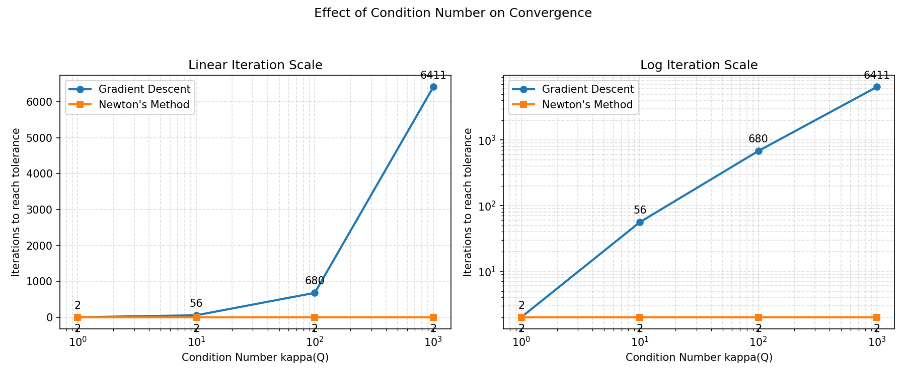
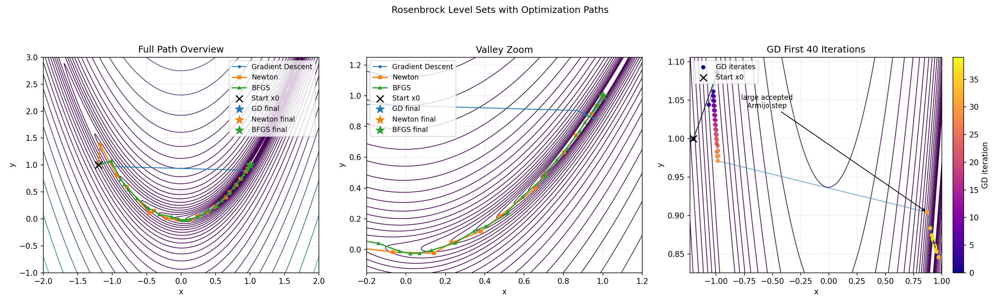
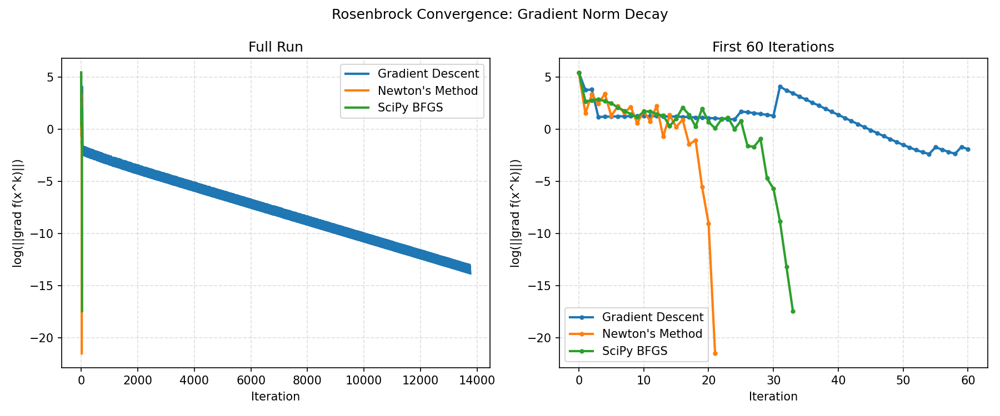
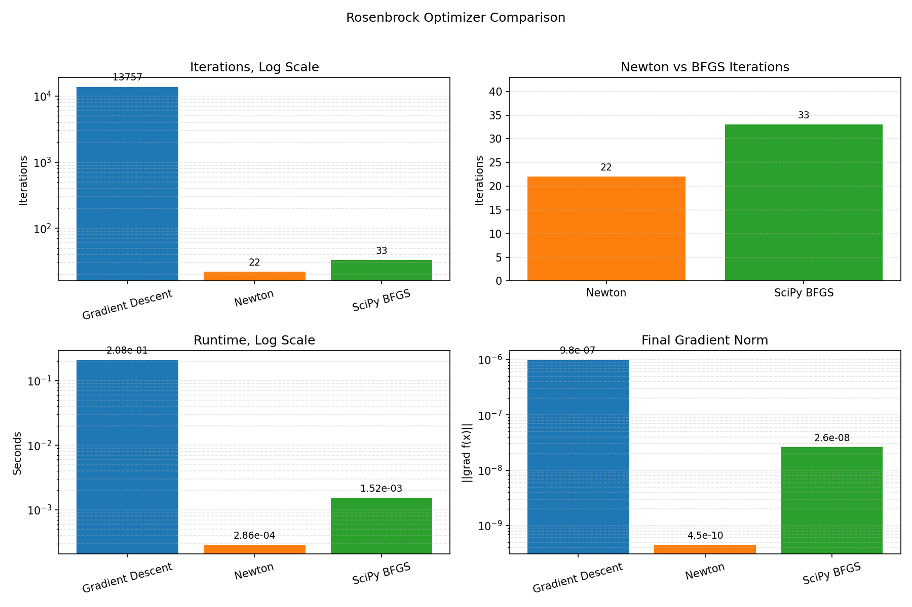
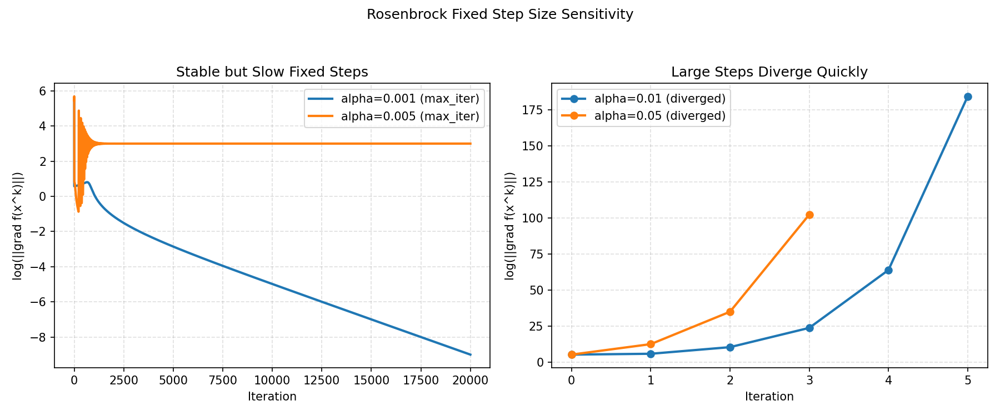

# Project 7: Convergence Anatomy of Second-Order and Quasi-Newton Methods

## Slide 1: Title

**Convergence Anatomy of Second-Order and Quasi-Newton Methods**

Gradient Descent, Newton's Method, and BFGS on quadratic and Rosenbrock test problems.

Presented by: **[Your Name]** and **[Friend's Name]**

---

## Slide 2: Project Goal

This project studies why different optimization methods converge at very different speeds.

The comparison focuses on three methods:

| Method | Information Used | Main Tradeoff |
|---|---|---|
| Gradient Descent | Gradient only | Cheap iterations, slow on ill-conditioned problems |
| Newton's Method | Gradient and exact Hessian | Fast convergence, expensive iterations |
| BFGS | Gradient and approximate curvature | Newton-like behavior without exact Hessians |

The main question is: **when does each method win, and why?**

---

## Slide 3: Mathematical Setup

We minimize a smooth function:

```text
minimize f(x)
```

Gradient Descent update:

```text
x_{k+1} = x_k - alpha_k grad f(x_k)
```

Newton update:

```text
H_k p_k = grad f(x_k)
x_{k+1} = x_k - p_k
```

In the implementation, Gradient Descent uses **Armijo backtracking line search**, and Newton's Method uses **numpy.linalg.solve** instead of explicitly inverting the Hessian.

---

## Slide 4: Test Problems

Two main test settings were used.

The first test problem is a strongly convex quadratic:

```text
f(x) = x^T Qx - b^T x
```

This is useful because the exact solution is known:

```text
x* = 0.5 solve(Q, b)
```

The second test problem is the Rosenbrock function:

```text
f(x, y) = (1 - x)^2 + 100(y - x^2)^2
```

Rosenbrock has a narrow curved valley and is difficult for Gradient Descent. The minimizer is `(1, 1)`, and the Hessian condition number near the minimizer is about `2508`.

---

## Slide 5: Quadratic Verification

For the quadratic verification, we used:

```text
Q = [[3, 1],
     [1, 2]]

b = [1, 2]
```

The analytical solution is:

```text
x* = [0, 0.5]
```

| Method | Iterations | Final Point | Final \|\|grad\|\| |
|---|---:|---|---:|
| Gradient Descent | 70 | `[9.97e-08, 5.00000062e-01]` | 8.48e-07 |
| Newton's Method | 2 | `[0, 0.5]` | 0.00e+00 |

Both implementations reached the analytical minimizer. Newton's Method converged almost immediately because the objective is exactly quadratic and the Hessian is constant.

---

## Slide 6: Condition Number Experiment

The condition number measures how stretched the objective's level sets are:

```text
kappa(Q) = lambda_max / lambda_min
```

Large condition numbers create narrow valleys, which slow down Gradient Descent.

| kappa(Q) | GD Iterations | Newton Iterations |
|---:|---:|---:|
| 1 | 2 | 2 |
| 10 | 56 | 2 |
| 100 | 680 | 2 |
| 1000 | 6411 | 2 |

Gradient Descent slows down dramatically as `kappa(Q)` increases. Newton's Method remains at 2 iterations because it directly uses the curvature of the quadratic.

---

## Slide 7: Condition Number Plot



This plot shows the central result of the condition-number study: Gradient Descent iteration count grows quickly with conditioning, while Newton's Method is nearly flat.

---

## Slide 8: Rosenbrock Path Visualization

Both methods were started from:

```text
x0 = (-1.2, 1)
```



The plot now shows all three methods. The first panel is the full overview, the second panel zooms into the valley, and the third panel shows the first 40 Gradient Descent iterations. The long GD segment is not a bug; it is a large Armijo-accepted step after early zig-zagging. Newton and BFGS take shorter curvature-aware paths.

---

## Slide 9: Rosenbrock Convergence Phases



The vertical axis is:

```text
log(||grad f(x_k)||)
```

Gradient Descent has a long linear convergence phase. Newton's Method has a short initial phase and then rapid local convergence near the minimizer. BFGS appears between them: it is not exact Newton, but it reduces the gradient norm much faster than Gradient Descent.

The right panel zooms into the first 60 iterations so the BFGS and Newton behavior is visible instead of being compressed by the long Gradient Descent run.

---

## Slide 10: BFGS Comparison

BFGS is a quasi-Newton method. It approximates curvature from previous steps and gradients instead of using the exact Hessian.

On Rosenbrock from `(-1.2, 1)`:

| Method | Iterations | Runtime Seconds | Final \|\|grad\|\| |
|---|---:|---:|---:|
| Gradient Descent | 13757 | 0.2085 | 9.83e-07 |
| Newton's Method | 22 | 0.0003 | 4.47e-10 |
| SciPy BFGS | 33 | 0.0015 | 2.59e-08 |

BFGS needed more iterations than exact Newton, but it was much closer to Newton than to Gradient Descent.

---

## Slide 11: BFGS Plot



The plot makes the difference clear: Gradient Descent requires thousands of iterations, while Newton and BFGS converge in a few dozen iterations.

The log-scale panels make all three methods visible, and the Newton-vs-BFGS zoom shows the main quasi-Newton comparison directly.

BFGS is practically attractive because it gets curvature-like behavior without explicitly computing the exact Hessian.

---

## Slide 12: Step Size Sensitivity

Fixed-step Gradient Descent was tested with:

```text
alpha in {0.001, 0.005, 0.01, 0.05}
```

| Step Size | Status | Iterations | Final \|\|grad\|\| |
|---:|---|---:|---:|
| 0.001 | Stable but slow | 20000 | 1.24e-04 |
| 0.005 | Did not reach tolerance | 20000 | 2.00e+01 |
| 0.01 | Diverged | 6 | 1.12e+80 |
| 0.05 | Diverged | 4 | 2.97e+44 |

Small fixed steps are slow. Large fixed steps are unstable. This explains why line search is important.

---

## Slide 13: Step Size Plot



The plot shows that fixed step sizes behave very differently on the same problem. A step size that is too small wastes iterations, while a step size that is too large quickly causes divergence.

Armijo line search avoids this by adapting the step size during the run.

---

## Slide 14: Main Conclusions

The experiments match the theory.

Gradient Descent is simple and cheap per iteration, but it is very sensitive to condition number and step size.

Newton's Method converges in very few iterations because it uses exact curvature information, but each iteration requires Hessian information and a linear solve.

BFGS is a strong practical compromise. It behaves much more like Newton's Method than Gradient Descent, while avoiding exact Hessian computation.

The main lesson is that curvature information is extremely valuable for difficult smooth optimization problems.

---

## Slide 15: Reproducibility

All experiments can be regenerated with:

```bash
MPLCONFIGDIR=/private/tmp python src/run_all.py
```

The tests can be run with:

```bash
MPLCONFIGDIR=/private/tmp python -m unittest discover -s tests
```

Project deliverables:

```text
reports/final_report.md
reports/presentation_slides.md
results/*.png
results/*.csv
```
